# Algoritmos desarrollados en PSeInt

Instituto Profesional de Educación Comunitaria  
:house: IPEC Santo Domingo de Heredia  
Autor: Jesús Alberto Moscoso Agüero  
:v: J. Mosro  
:email: jmosro.14@gmail.com  
2021-2020  
:costa_rica:  

## [**Java_GTA_2021/**](Java_GTA_2021)

Ejercicios resueltos en lenguaje Java, para trabajo en clase y casa. Desarrollo en GTA - Guías de Trabajo Autónomo del 2021. Subárea: Programación, del tercer año. Carrera: Técnico Medio en Informática en Desarrollo de Software.

[**Proyecto Figuras Geométricas**](Java_GTA_2021/FigurasGeometricas) :label:  
Calcular el área, perímetro y volumen de varias tipos de figuras geométricas.
`Área:`  
`01. Círculo.`  
`02. Cuadrado.`  
`03. Polígono.`  
`04. Rectángulo.`  
`05. Rombo.`  
`06. Trapecio.`  
`07. Triángulo.`  
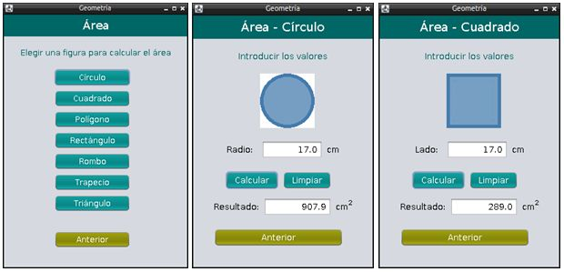
`Perímetro:`  
`01. Círculo.`  
`02. Cuadrado.`  
`03. Polígono.`  
`04. Rectángulo.`  
`05. Rombo.`  
`06. Trapecio.`  
`07. Triángulo.`  
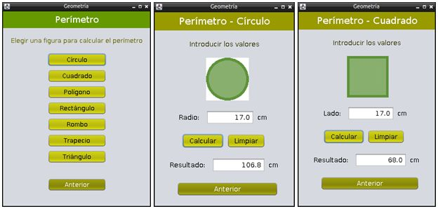
`Volumen:`  
`01. Cilindro.`  
`02. Cubo.`  
`03. Esfera.`  
`04. Paralelepípedo.`  
`05. Pirámide.`  
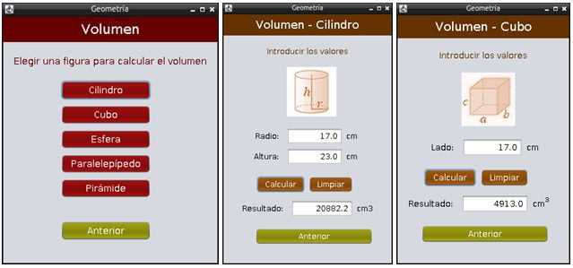

[**Proyecto Programas Útiles**](Java_GTA_2021/ProgramasUtiles) :label:  
Programas sencillos para utilitarios para manipulación de números.
`01. Cifras de un número. Pedir por pantalla un número entre 0 y 999.999 y mostrar cuantas cifras tiene.`  
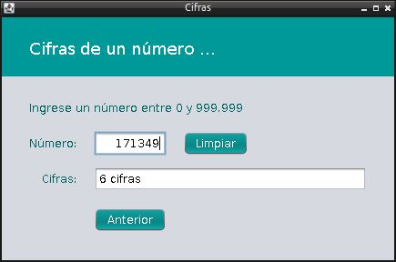
`02. Reverso de un número. Pedir por pantalla un número entre 0 y 999.999 y mostralo al revés.` 
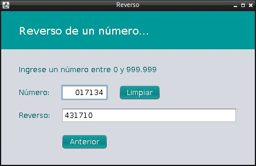
`03. Escritura de un número. Pedir por pantalla un número entre 0 y 99 y mostrarlo escrito.`  
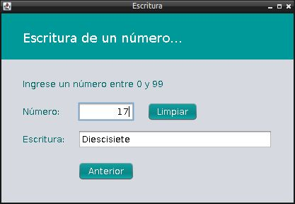
`04. Días entre fechas. Pedir por pantalla dos fechas y calcular la cantidad de días entre fechas.`  
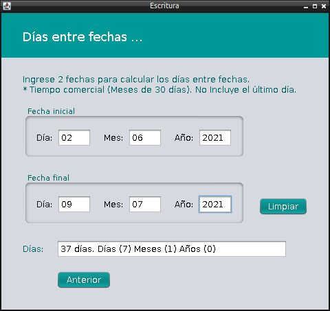 

## [**Java_GTA_2020/**](Java_GTA_2020)

Ejercicios resueltos en lenguaje Java, para trabajo en clase y casa. Desarrollo en GTA - Guías de Trabajo Autónomo del 2020. Subárea: Programación, del segundo año. Carrera: Técnico Medio en Informática en Desarrollo de Software. Nota: Estos ejemplos nos basamos en recursos ya creados por otras personas, adaptados a detalles propios.

[**Proyecto Calculadora**](Java_GTA_2020/Calculadora) :label:  
Recurso adaptado. Calculadora. Operaciones de suma, resta, multiplicación, división. Capacidad para decimales positivos y negativos. Otros para raíz cuadrada, 1 división número y número elevado.
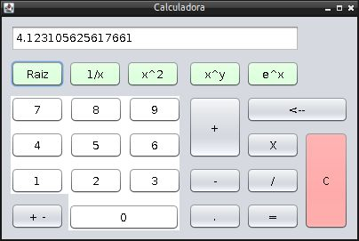

[**Proyecto Registro Empleado**](Java_GTA_2020/RegistroEmpleado) :label:  
Recurso adaptado. Registrar empleados. Operaciones de grabar, nuevo, editar (actualizar), eliminar empleado.`  
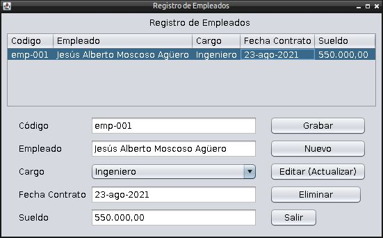

[**Proyecto Sistema Tienda Ropa**](Java_GTA_2020/SistemaTiendaRopa) :label:  
Recurso adaptado. Registrar diferentes productos de ropa, en el programa de facturación. Operaciones de calcular descuentos, total neto a pagar, limpiar tabla, quitar compra y generar compra.`  
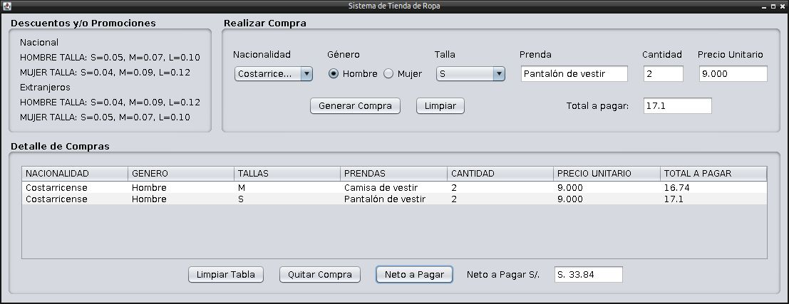

## [**Java_EstrategiaEvaluacion_2020/**](Java_EstrategiaEvaluacion_2020)

Ejercicios resueltos en lenguaje Java, para trabajo en clase y casa. Desarrollo en Estrategía de Evaluación del 2020. Subárea: Programación, del tercer año. Carrera: Técnico Medio en Informática en Desarrollo de Software.

[**Proyecto Notas Estudiante**](Java_EstrategiaEvaluacion_2020/NotasEstudiante) :label:  
Registrar la nota de un estudiante. Operaciones de grabar, nuevo, editar, eliminar y calcular la nota final.`  
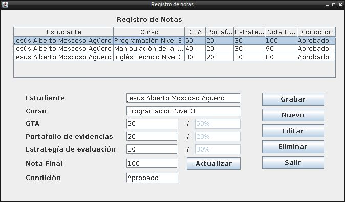

---
